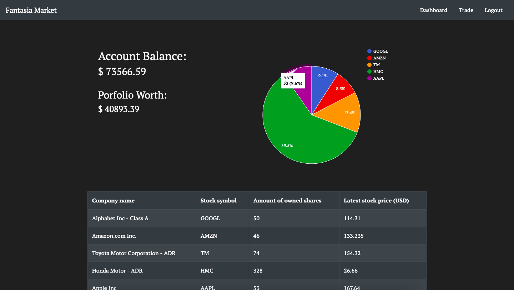
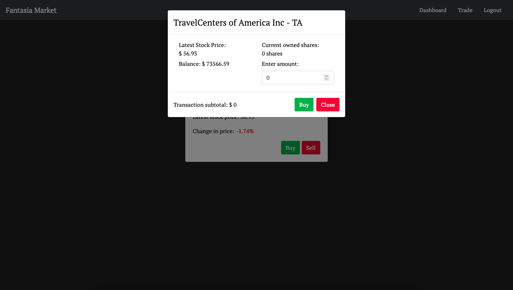

## fantasia-market
`fantasia market` is a simulated stock trading application utilizing React, Express.js, and Postgresql. This project improved upon the fundamentals of React's custom hooks, functional component lifecycles, and altering data within a Postgresql database.

[Live Demo](https://react-fantasia-market.herokuapp.com/)

### Summary

Has the thought of trying the stock market ever came across your mind? Have you downloaded mobile applications such as Robinhood to put a small amount of money to test the waters? Begin testing your skills or luck with `fantasia market` by just creating an account to start off with $100,000!

Using a Postgresql database, `fantasia market` stores user information, purchased stocks, and balances. Depending on the transaction type, the database will dynamically be updated accordingly. `fantasia market` helped introduced the usage of custom hooks to structure states to their respective components. This helped keep states and their logic separate from the application scope.

### Installation Instructions
1. In the root of the project, run `npm i` in the terminal.
2. In the root of the project, run `npm run heroku-postbuild` in the terminal.
3. In Postgres; create a new database called `fantasia_market`.
4. Run the `seed.sql` SQL code against the newly created database in step 4.
5. Navigate to the [IEX Cloud](https://iexcloud.io/) website to create an account and API keys.
6. Clone the `.env_template` file in the `server` folder, rename it to `.env` and replace the environment variables with their appropriate values.
7. In the root of the project, run `npm run dev-start` in the terminal.
